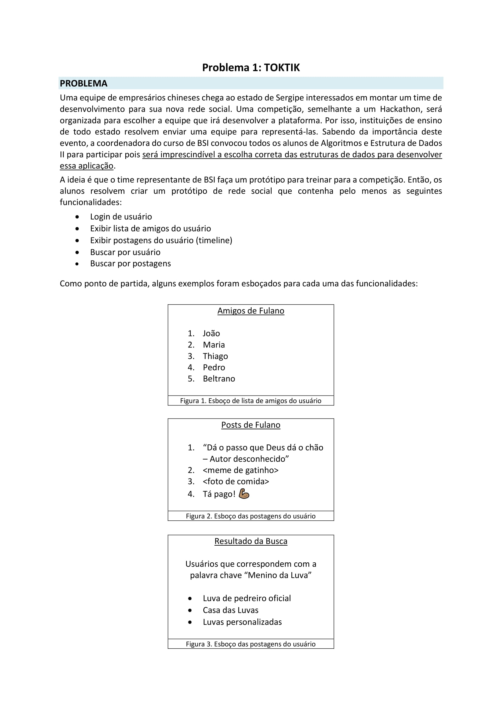
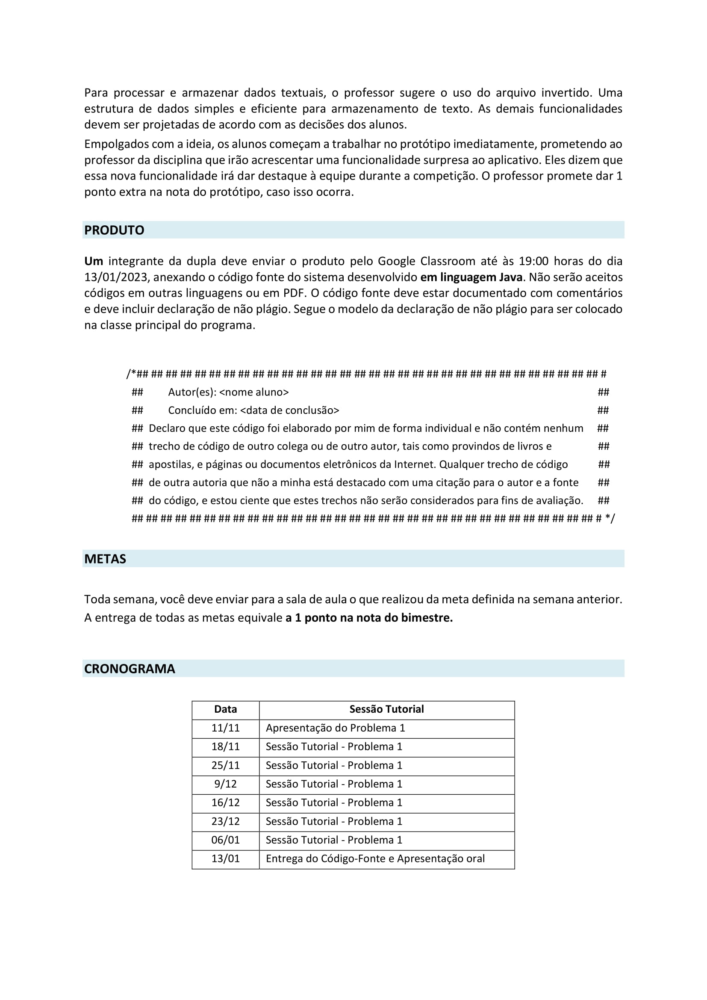

### Algoritmos e Estrutura de Dados II 2022.2
Codigos e projeto desenvolvidos na matéria de Algoritmos e Estrutura de Dados II no periodo de 2022.2 ministrada pelo professor [João Paulo](https://github.com/JoaoAlmeida)
## Project Based Learning

